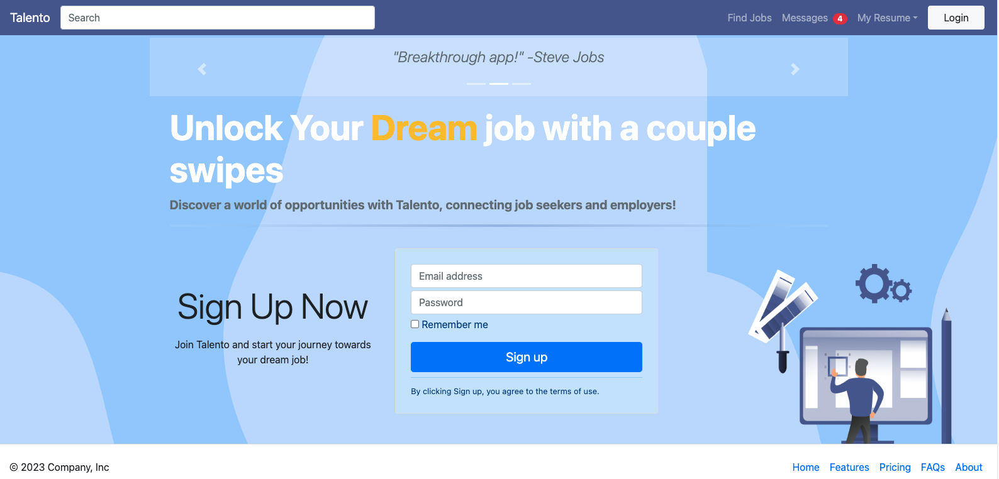

# Talento (bootstrap)

This is a recreation of our final project Talento <https://github.com/Ruheee/Talento> using Bootstrap v4 framework. This app uses a simple Express server to serve the static files.

## Purpose

The goal of this project is to demonstrate the use of Bootstrap v4 framework in creating a responsive web application.

## Gallery

|  | 
|:--:| 
| Landing Page |

## Getting Started

- Install all dependencies with `npm install`
- Run the Webpack Development Server from the scheduler directory with `npm start`. The Webpack Development Server will run in localhost PORT:3000

## Dependencies

- bootstrap @ 5.2.3
- cookie-parser @ 1.4.4
- debug @ 2.6.9
- express @ 4.16.1
- http-errors @ 1.6.3
- jade @ 1.11.0
- morgan @ 1.9.1

## Footnote

This project was created and published by [Jerome Lagbas](https://github.com/jeromealmir).
